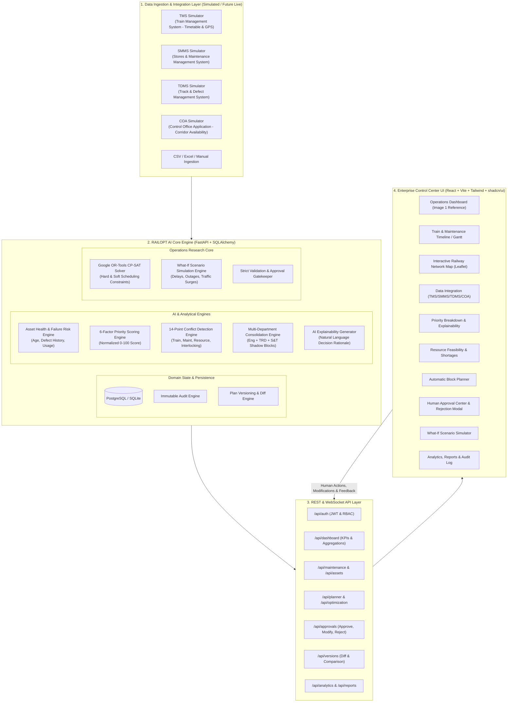

# RAILOPT AI — System Architecture Specification
**SIH26027 — AI-Powered Automatic Block Planning to Maximize Asset Availability for Train Operations on Indian Railways**

---

## 1. Executive Summary & Problem Scope

**RAILOPT AI** is an enterprise-grade railway maintenance block planning, conflict detection, and decision-support optimization platform. 

### SIH26027 Problem Context
On Indian Railways, track, overhead electrical (TRD/OHE), and signaling & telecom (S&T) assets require regular preventive and corrective maintenance. However, maintenance requires "traffic blocks" (suspending or rerouting train traffic on a track section) and "power blocks" (de-energizing OHE traction lines). 

Traditionally, block planning is performed manually through inter-departmental coordination meetings (Engineering, TRD, S&T, Operating/Control Office), leading to:
1. **Low Asset Availability**: Conservative scheduling leaves tracks idle or fails to address critical defects promptly.
2. **Sub-optimal Block Consolidation**: Different departments request blocks on the same section at different times, multiplying traffic disruption.
3. **Severe Operational Disruption**: Uncoordinated blocks delay high-priority passenger and freight trains.
4. **Resource Bottlenecks**: Blocks are granted but wasted because heavy track machines (e.g., BCM, CSM, Tamping machines), specialized manpower, or safety equipment were unavailable.
5. **No What-If Intelligence**: When trains run late or urgent maintenance arises, controllers lack algorithmic support to dynamically adapt and re-optimize.

**RAILOPT AI** solves SIH26027 by combining **Machine Learning risk intelligence**, **multi-factor priority scoring**, **mathematical constraint programming (Google OR-Tools CP-SAT)**, **multi-department consolidation**, and a **Human-in-the-Loop (HITL) approval governance system**.

---

## 2. High-Level System Architecture

---

## 3. Component Deep Dive

### 3.1 Data Ingestion & Integration Layer
- **Simulated Integration Gateways**:
  - `TMS Gateway`: Emulates Train Management System schedules, train categories (Rajdhani, Superfast, Mail/Express, Passenger, Freight), and section run times.
  - `SMMS Gateway`: Emulates Stores/Maintenance material inventories, machine rosters, and maintenance team rosters.
  - `TDMS Gateway`: Ingests track geometry defects, ultrasonic flaw detections (USFD), OHE inspection anomalies, and signal relay failures.
  - `COA Gateway`: Provides corridor operational windows, planned freight corridors, and section headway rules.
- **Demo Data Disclaimer Badge**: Clearly communicates in every view:
  > `DEMO / SIMULATED DATA — NOT CONNECTED TO LIVE INDIAN RAILWAYS SYSTEMS`
- **File Ingestion**: Supports drag-and-drop CSV and Excel uploads for assets, defects, maintenance tasks, and train timetables with schema validation.

### 3.2 Asset Health & Failure Risk Engine
- **Health Index Calculation**:
  Combines asset age, defect count, overdue maintenance cycles, traffic intensity (gross million tonnes / GMT), and historical failure rates into a composite score (0–100%).
- **Risk Assessment**:
  Outputs failure probability ($P_f \in [0, 1]$), safety risk category (`LOW`, `MEDIUM`, `HIGH`, `CRITICAL`), and operational impact assessment with confidence scores and explainable risk factors.

### 3.3 6-Factor Priority Engine
Implements the exact formula:
$$\text{Priority Score} = 0.30 \times S + 0.20 \times P_f + 0.15 \times C_a + 0.15 \times U_m + 0.10 \times I_o + 0.10 \times D_s$$
Where:
- $S$: Safety Risk (0–100)
- $P_f$: Failure Probability (0–100)
- $C_a$: Asset Criticality (0–100)
- $U_m$: Maintenance Urgency (0–100)
- $I_o$: Traffic / Operational Impact (0–100)
- $D_s$: Defect Severity (0–100)
- **Priority Bands**:
  - `90–100`: **CRITICAL** (Mandatory escalation & scheduling priority)
  - `75–89`: **HIGH**
  - `50–74`: **MEDIUM**
  - `0–49`: **LOW**
- **Safety Override**: If $S \ge 90$ or a safety-critical defect is detected, the task bypasses ordinary deferrals and triggers mandatory block allocation.

### 3.4 Resource Planning & Feasibility Engine
Tracks 8 resource categories:
1. `Manpower` (track gangs, technicians, OHE linemen, signal technicians)
2. `Supervisors / Engineers` (Section Engineers / SSE)
3. `Heavy Track Machines` (CSM, BCM, Tamping, Ballast Regulators, Tower Wagons)
4. `Maintenance Vehicles` (Utility vans, road-cum-rail vehicles)
5. `Tools & Equipment` (Rail cutting, welding equipment, tensioning jacks)
6. `Materials` (Sleepers, rails, ballast, OHE contact wire, signal relays)
7. `Safety Equipment` (Detonators, banner flags, earthing discharge rods, red hand lamps)
8. `Specialists` (Welders, ultrasonic testing specialists, interlocking engineers)

- **Hard Feasibility Check**: If any mandatory resource has zero availability or exceeds concurrent section limits, the task is marked `INFEASIBLE` with root-cause identification and alternative resource suggestions.

### 3.5 14-Point Conflict Detection Engine
Detects:
1. `Train vs Maintenance`: Train scheduled during an active track/power block.
2. `Maintenance vs Maintenance`: Incompatible work on the same section.
3. `Resource Conflict`: Machine or gang double-booked across different locations.
4. `Department Conflict`: OHE power shutoff conflicting with electrical train movements or interlocking tests.
5. `Corridor Conflict`: Up and Down lines blocked simultaneously without crossover capacity.
6. `Section Occupancy Conflict`: Block exceeding section buffer times.
7. `Time-Window Conflict`: Maintenance scheduled outside permitted daylight/night slots.
8. `Safety-Buffer Conflict`: Insufficient safety margins between train passage and block commencement.
9. `Machine Conflict`: Track machine required in two distant sections without realistic transit time.
10. `Vehicle Conflict`: Road-cum-rail vehicle over-allocation.
11. `Manpower Conflict`: Gang size deficit or overtime limitation violations.
12. `Specialist Conflict`: Mandatory specialist missing or overlapping.
13. `Material Conflict`: Insufficient inventory at local depot.
14. `Dependency Conflict`: Task B scheduled before prerequisite Task A completes.

### 3.6 Multi-Department Consolidation Engine
Consolidates maintenance requests from **Engineering (Civil)**, **TRD (Traction Distribution)**, and **S&T (Signaling & Telecom)** into **Unified Maintenance Blocks**:
- Identifies tasks sharing the same or adjacent track sections.
- Evaluates resource compatibility and safety protocols (e.g., verifying OHE power isolation while track tamping occurs).
- Generates "Shadow Blocks" to perform minor S&T or OHE inspection during major track renewal blocks, saving up to 40% of cumulative block downtime.

### 3.7 Google OR-Tools CP-SAT Optimization Core
Formulates the Block Planning Problem as a Constraint Satisfaction and Integer Optimization model:
- **Decision Variables**: Block start time $t_{start}(b)$, end time $t_{end}(b)$, binary assignment $x_{i,b} \in \{0, 1\}$, and resource allocation matrices.
- **Hard Constraints**: Headway buffers, single-track exclusivity, resource capacities, mandatory safety windows, task dependencies.
- **Multi-Objective Function**:
  $$\min \left( w_1 \cdot \text{Disruption} + w_2 \cdot \text{Downtime} + w_3 \cdot \text{Conflicts} + w_4 \cdot \text{ResourceIdle} \right) - \left( w_5 \cdot \text{AssetAvailability} + w_6 \cdot \text{PriorityCoverage} + w_7 \cdot \text{Consolidation} \right)$$
- **Infeasible Handling**: When constraints conflict, CP-SAT provides the minimal infeasible core (unsatisfied constraints) and suggests relaxations (e.g., deferring low-priority tasks or extending window bounds).

### 3.8 Human-in-the-Loop Approval & Versioning Engine
1. **No Autonomous Authorization**: AI produces candidate plans; human controllers (`Control Office / SrDOM`, `Engineering`, `TRD`, `S&T`) verify.
2. **Approval Validation Gates**: Approval is blocked if critical conflicts or safety violations exist.
3. **Modify & Approve**: Controllers can drag-and-drop or adjust times and resources; the engine recalculates feasibility in real-time.
4. **Reject & Recalculate**: Captures structured rejection codes + free-text instructions, adjusts solver penalty weights, and generates an immutable `V(n+1)` plan with full natural language diffs.

---

## 4. Technology Stack & Rationale

| Layer | Selected Tech | Rationale |
|---|---|---|
| **Frontend Framework** | React 18 + TypeScript | Type-safe, component-driven UI for complex dashboards. |
| **Build Tool & Bundler** | Vite | Instant HMR, optimized builds. |
| **Styling & Components** | Tailwind CSS + shadcn/ui | Clean, customizable enterprise dark-mode aesthetics matching the control center design reference. |
| **Icons & Visuals** | Lucide React | Consistent, high-fidelity icon set. |
| **Charts & Graphs** | Recharts + D3-scale | Data-rich donuts, bar charts, area charts, and custom timeline visualizations. |
| **Map Engine** | Leaflet / React-Leaflet | Lightweight, zero-API-key railway corridor schematic and GIS mapping. |
| **Backend Framework** | FastAPI (Python 3.11+) | Async high-performance REST APIs, automatic OpenAPI docs, native Pydantic validation. |
| **ORM & DB Layer** | SQLAlchemy 2.0 + SQLite (Local) / PostgreSQL | Robust relational modeling, migration support via Alembic. |
| **Optimization Core** | Google OR-Tools (CP-SAT) | Gold-standard solver for finite-domain scheduling, interval variables, and cumulative resource constraints. |
| **AI / ML & Analytics** | NumPy, Pandas, Scikit-learn | Fast feature processing, risk scoring regressions, and statistical aggregations. |
| **Authentication** | Passlib (bcrypt) + PyJWT | Role-Based Access Control (RBAC) with secure hashed passwords. |
| **Testing** | Pytest, HTTPX, Vitest | Comprehensive backend unit/integration tests and frontend component tests. |
