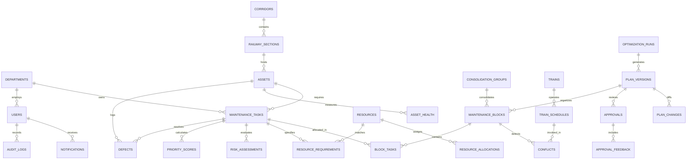

# RAILOPT AI — Database Schema Specification
**SIH26027 — Enterprise Data Model & Entity-Relationship Architecture**

---

## 1. Overview & Principles

The RAILOPT AI database supports both **PostgreSQL** (production) and **SQLite** (local hackathon / demo mode).
Key architectural principles:
1. **Relational Integrity**: Strict foreign key relationships across departments, corridors, sections, assets, tasks, and blocks.
2. **Immutable Audit & Versioning**: Plan versions, approval histories, and audit logs are append-only.
3. **High-Performance Indexing**: Indexed lookups on task priorities, risk categories, section IDs, time windows, and plan versions.
4. **JSON Metadata Flexibility**: Supports structured metadata for machine/specialist specs, conflict details, and solver constraint diagnostics.

---

## 2. Entity-Relationship Diagram (ERD)

---

## 3. Detailed Entity Definitions

### 3.1 Core Organizational & Access Entities

#### `departments`
Stores operating departments involved in railway block coordination.
| Column | Type | Constraints | Description |
|---|---|---|---|
| `id` | VARCHAR(32) | PRIMARY KEY | e.g., `ENG`, `TRD`, `SNT`, `OPT` |
| `name` | VARCHAR(128) | NOT NULL | e.g., `Engineering (Civil)`, `TRD (Electrical)`, `S&T (Signals)` |
| `color_code` | VARCHAR(16) | NOT NULL | Hex color for UI badges (e.g., `#3b82f6`) |
| `created_at` | TIMESTAMP | DEFAULT NOW() | Timestamp of creation |

#### `users`
System users with Role-Based Access Control (RBAC).
| Column | Type | Constraints | Description |
|---|---|---|---|
| `id` | VARCHAR(64) | PRIMARY KEY | UUID or identifier |
| `username` | VARCHAR(64) | UNIQUE, NOT NULL | Login handle (e.g., `demo@railopt.ai`) |
| `email` | VARCHAR(128) | UNIQUE, NOT NULL | User email address |
| `hashed_password` | VARCHAR(256) | NOT NULL | bcrypt hash |
| `full_name` | VARCHAR(128) | NOT NULL | e.g., `Shri Rajesh Sharma` |
| `department_id` | VARCHAR(32) | FK(departments.id) | Assigned department |
| `role` | VARCHAR(32) | NOT NULL | `CONTROL_OFFICE`, `ENGINEERING`, `TRD`, `SNT`, `ADMIN`, `DEMO_USER` |
| `is_active` | BOOLEAN | DEFAULT TRUE | Active flag |
| `created_at` | TIMESTAMP | DEFAULT NOW() | Record creation |

---

### 3.2 Infrastructure & Network Topology

#### `corridors`
Major railway routes/lines.
| Column | Type | Constraints | Description |
|---|---|---|---|
| `id` | VARCHAR(32) | PRIMARY KEY | e.g., `COR-DEL-BOM`, `COR-DEL-HWH` |
| `name` | VARCHAR(128) | NOT NULL | e.g., `Delhi - Mumbai Golden Quadrilateral` |
| `code` | VARCHAR(16) | UNIQUE, NOT NULL | e.g., `DLI-MMCT` |
| `total_length_km` | FLOAT | NOT NULL | Corridor length in km |
| `created_at` | TIMESTAMP | DEFAULT NOW() | Timestamp |

#### `railway_sections`
Individual block sections or station-to-station track segments.
| Column | Type | Constraints | Description |
|---|---|---|---|
| `id` | VARCHAR(64) | PRIMARY KEY | e.g., `SEC-NDLS-ALD`, `SEC-ALD-BPL` |
| `corridor_id` | VARCHAR(32) | FK(corridors.id) | Parent corridor |
| `name` | VARCHAR(128) | NOT NULL | e.g., `New Delhi - Prayagraj (Line Up)` |
| `track_type` | VARCHAR(32) | NOT NULL | `SINGLE`, `DOUBLE_UP`, `DOUBLE_DOWN`, `MULTIPLE` |
| `speed_limit_kmh` | INTEGER | NOT NULL | Default sectional speed limit (e.g., 130) |
| `length_km` | FLOAT | NOT NULL | Segment length |
| `start_km` | FLOAT | NOT NULL | Chainage start |
| `end_km` | FLOAT | NOT NULL | Chainage end |
| `status` | VARCHAR(32) | DEFAULT 'NORMAL' | `NORMAL`, `RESTRICTED`, `BLOCKED`, `MAINTENANCE` |
| `coordinates_json` | JSON | NULLABLE | Latitude/Longitude coordinates for Leaflet rendering |

#### `assets`
Physical railway assets (tracks, OHE, signals, turnouts, bridges).
| Column | Type | Constraints | Description |
|---|---|---|---|
| `id` | VARCHAR(64) | PRIMARY KEY | e.g., `AST-TRK-7A`, `AST-OHE-ALD-12` |
| `section_id` | VARCHAR(64) | FK(railway_sections.id) | Host section |
| `department_id` | VARCHAR(32) | FK(departments.id) | Managing department |
| `asset_type` | VARCHAR(64) | NOT NULL | `TRACK`, `TURNOUT`, `OHE_MAST`, `SIGNAL_POST`, `POINT_MACHINE` |
| `name` | VARCHAR(128) | NOT NULL | Display name |
| `installation_date` | DATE | NOT NULL | Commissioning date |
| `criticality` | VARCHAR(16) | NOT NULL | `LOW`, `MEDIUM`, `HIGH`, `CRITICAL` |
| `cumulative_gmt` | FLOAT | DEFAULT 0.0 | Gross Million Tonnes traffic carried |
| `last_maintenance_date` | DATE | NULLABLE | Last overhaul date |

#### `asset_health`
Computed and historical health assessments.
| Column | Type | Constraints | Description |
|---|---|---|---|
| `id` | VARCHAR(64) | PRIMARY KEY | UUID |
| `asset_id` | VARCHAR(64) | FK(assets.id) | Evaluated asset |
| `health_score` | FLOAT | NOT NULL | 0.0 – 100.0% composite health |
| `failure_probability` | FLOAT | NOT NULL | 0.0 – 1.0 probability |
| `defect_count` | INTEGER | DEFAULT 0 | Active defects count |
| `overdue_days` | INTEGER | DEFAULT 0 | Days overdue past scheduled maintenance |
| `urgency_level` | VARCHAR(16) | NOT NULL | `ROUTINE`, `URGENT`, `IMMEDIATE` |
| `evidence_summary` | TEXT | NULLABLE | Machine learning feature reasoning |
| `assessed_at` | TIMESTAMP | DEFAULT NOW() | Timestamp |

#### `defects`
Defects logged in TDMS / TMS.
| Column | Type | Constraints | Description |
|---|---|---|---|
| `id` | VARCHAR(64) | PRIMARY KEY | e.g., `DEF-2025-0102` |
| `asset_id` | VARCHAR(64) | FK(assets.id) | Target asset |
| `defect_type` | VARCHAR(64) | NOT NULL | `USFD_FLAW`, `RAIL_FRACTURE`, `OHE_SAGGING`, `SIGNAL_FAILURE` |
| `severity` | VARCHAR(16) | NOT NULL | `LOW`, `MEDIUM`, `HIGH`, `CRITICAL` |
| `detected_date` | DATE | NOT NULL | Detection date |
| `status` | VARCHAR(32) | DEFAULT 'OPEN' | `OPEN`, `IN_PROGRESS`, `RESOLVED`, `DEFERRED` |
| `description` | TEXT | NULLABLE | Technical details |

---

### 3.3 Maintenance Tasks & Priority

#### `maintenance_tasks`
Maintenance tasks requested or generated.
| Column | Type | Constraints | Description |
|---|---|---|---|
| `id` | VARCHAR(64) | PRIMARY KEY | e.g., `MT-001`, `MT-002` |
| `asset_id` | VARCHAR(64) | FK(assets.id) | Target asset |
| `section_id` | VARCHAR(64) | FK(railway_sections.id) | Work location |
| `department_id` | VARCHAR(32) | FK(departments.id) | Owning department |
| `task_type` | VARCHAR(64) | NOT NULL | `TAMPING`, `RAIL_RENEWAL`, `OHE_INSPECTION`, `SIGNAL_TESTING` |
| `defect_id` | VARCHAR(64) | FK(defects.id), NULLABLE | Associated defect |
| `severity` | VARCHAR(16) | NOT NULL | `LOW`, `MEDIUM`, `HIGH`, `CRITICAL` |
| `requested_date` | DATE | NOT NULL | Initial submission date |
| `due_date` | DATE | NOT NULL | Regulatory compliance deadline |
| `estimated_duration_min` | INTEGER | NOT NULL | Estimated block duration (e.g., 180 min) |
| `preferred_window_start` | TIMESTAMP | NULLABLE | Preferred start time |
| `preferred_window_end` | TIMESTAMP | NULLABLE | Preferred end time |
| `mandatory_window_start` | TIMESTAMP | NULLABLE | Strict start limit |
| `mandatory_window_end` | TIMESTAMP | NULLABLE | Strict end limit |
| `safety_critical_flag` | BOOLEAN | DEFAULT FALSE | Requires mandatory block allocation |
| `status` | VARCHAR(32) | DEFAULT 'PENDING' | `PENDING`, `AT_RISK`, `SCHEDULED`, `IN_PROGRESS`, `COMPLETED`, `DEFERRED`, `REJECTED`, `BLOCKED` |
| `dependencies_json` | JSON | NULLABLE | Array of prerequisite task IDs |
| `notes` | TEXT | NULLABLE | Engineering notes |

#### `priority_scores`
Explicit 6-factor priority breakdown.
| Column | Type | Constraints | Description |
|---|---|---|---|
| `id` | VARCHAR(64) | PRIMARY KEY | UUID |
| `task_id` | VARCHAR(64) | FK(maintenance_tasks.id) | Linked task |
| `safety_risk` | FLOAT | NOT NULL | Factor 1: 0–100 (Weight: 0.30) |
| `failure_probability` | FLOAT | NOT NULL | Factor 2: 0–100 (Weight: 0.20) |
| `asset_criticality` | FLOAT | NOT NULL | Factor 3: 0–100 (Weight: 0.15) |
| `maintenance_urgency` | FLOAT | NOT NULL | Factor 4: 0–100 (Weight: 0.15) |
| `traffic_impact` | FLOAT | NOT NULL | Factor 5: 0–100 (Weight: 0.10) |
| `defect_severity` | FLOAT | NOT NULL | Factor 6: 0–100 (Weight: 0.10) |
| `total_priority_score` | FLOAT | NOT NULL | Computed score (0–100) |
| `priority_category` | VARCHAR(16) | NOT NULL | `CRITICAL`, `HIGH`, `MEDIUM`, `LOW` |
| `ai_rationale` | TEXT | NOT NULL | Natural language explanation |
| `calculated_at` | TIMESTAMP | DEFAULT NOW() | Timestamp |

#### `risk_assessments`
Detailed risk evaluation.
| Column | Type | Constraints | Description |
|---|---|---|---|
| `id` | VARCHAR(64) | PRIMARY KEY | UUID |
| `task_id` | VARCHAR(64) | FK(maintenance_tasks.id) | Linked task |
| `safety_risk_level` | VARCHAR(16) | NOT NULL | `LOW`, `MEDIUM`, `HIGH`, `CRITICAL` |
| `failure_probability_val` | FLOAT | NOT NULL | Value 0.0–1.0 |
| `operational_impact_level` | VARCHAR(16) | NOT NULL | `LOW`, `MEDIUM`, `HIGH`, `CRITICAL` |
| `risk_category` | VARCHAR(16) | NOT NULL | Overall category |
| `confidence_score` | FLOAT | NOT NULL | 0.0–1.0 confidence |
| `evidence_json` | JSON | NULLABLE | Key contributing factors |
| `explanation` | TEXT | NOT NULL | Risk explanation string |

---

### 3.4 Resources & Allocations

#### `resources`
Physical and human resources available for maintenance.
| Column | Type | Constraints | Description |
|---|---|---|---|
| `id` | VARCHAR(64) | PRIMARY KEY | e.g., `RES-MCH-CSM-01`, `RES-TEAM-ENG-A` |
| `department_id` | VARCHAR(32) | FK(departments.id) | Owning department |
| `resource_type` | VARCHAR(32) | NOT NULL | `MANPOWER`, `SUPERVISOR`, `MACHINE`, `VEHICLE`, `TOOL`, `MATERIAL`, `SAFETY_EQUIP`, `SPECIALIST` |
| `name` | VARCHAR(128) | NOT NULL | e.g., `Continuous Tamping Machine CSM-101` |
| `base_section_id` | VARCHAR(64) | FK(railway_sections.id) | Depot / base location |
| `total_capacity` | INTEGER | NOT NULL | Total units available |
| `is_operational` | BOOLEAN | DEFAULT TRUE | Operational status |

#### `resource_requirements`
Resource demands defined per task.
| Column | Type | Constraints | Description |
|---|---|---|---|
| `id` | VARCHAR(64) | PRIMARY KEY | UUID |
| `task_id` | VARCHAR(64) | FK(maintenance_tasks.id) | Associated task |
| `resource_type` | VARCHAR(32) | NOT NULL | Resource category |
| `required_quantity` | INTEGER | NOT NULL | Units required |
| `is_mandatory` | BOOLEAN | DEFAULT TRUE | If true, missing resource makes block infeasible |
| `alternative_resource_type` | VARCHAR(32) | NULLABLE | Fallback resource category |

#### `resource_allocations`
Allocations made by the optimizer or human controller.
| Column | Type | Constraints | Description |
|---|---|---|---|
| `id` | VARCHAR(64) | PRIMARY KEY | UUID |
| `block_id` | VARCHAR(64) | FK(maintenance_blocks.id) | Target block |
| `resource_id` | VARCHAR(64) | FK(resources.id) | Allocated resource |
| `allocated_quantity` | INTEGER | NOT NULL | Units assigned |
| `start_time` | TIMESTAMP | NOT NULL | Reservation start |
| `end_time` | TIMESTAMP | NOT NULL | Reservation end |

---

### 3.5 Trains & Timetable Constraints

#### `trains`
Train master data.
| Column | Type | Constraints | Description |
|---|---|---|---|
| `id` | VARCHAR(64) | PRIMARY KEY | e.g., `TRN-12951`, `TRN-FRT-SZ314` |
| `train_number` | VARCHAR(32) | UNIQUE, NOT NULL | Train number (e.g., `12951`) |
| `train_name` | VARCHAR(128) | NOT NULL | e.g., `Mumbai Rajdhani Express` |
| `train_category` | VARCHAR(32) | NOT NULL | `COACHING_PREMIUM`, `COACHING_MAIL`, `PASSENGER`, `GOODS`, `SERVICE` |
| `priority_rank` | INTEGER | NOT NULL | Operational priority (1 = Rajdhani/Vande Bharat, 5 = Goods) |

#### `train_schedules`
Section traversal timetables (TMS data).
| Column | Type | Constraints | Description |
|---|---|---|---|
| `id` | VARCHAR(64) | PRIMARY KEY | UUID |
| `train_id` | VARCHAR(64) | FK(trains.id) | Train reference |
| `section_id` | VARCHAR(64) | FK(railway_sections.id) | Section traversed |
| `scheduled_entry` | TIMESTAMP | NOT NULL | Entry time |
| `scheduled_exit` | TIMESTAMP | NOT NULL | Exit time |
| `operating_window_start` | TIMESTAMP | NOT NULL | Permissible leeway start |
| `operating_window_end` | TIMESTAMP | NOT NULL | Permissible leeway end |
| `delay_minutes` | INTEGER | DEFAULT 0 | Simulated real-time delay |

---

### 3.6 Block Planning, Versions & Approvals

#### `optimization_runs`
Records of OR-Tools CP-SAT executions.
| Column | Type | Constraints | Description |
|---|---|---|---|
| `id` | VARCHAR(64) | PRIMARY KEY | e.g., `OPT-2025-0520-001` |
| `horizon_type` | VARCHAR(32) | NOT NULL | `TODAY`, `NEXT_7_DAYS`, `WEEKLY`, `MONTHLY` |
| `solver_status` | VARCHAR(32) | NOT NULL | `OPTIMAL`, `FEASIBLE`, `INFEASIBLE`, `TIMEOUT` |
| `execution_time_ms` | INTEGER | NOT NULL | Solver duration |
| `objective_value` | FLOAT | NULLABLE | Solver objective score |
| `parameters_json` | JSON | NOT NULL | Weights and configuration |
| `created_at` | TIMESTAMP | DEFAULT NOW() | Timestamp |

#### `plan_versions`
Immutable version history of block plans.
| Column | Type | Constraints | Description |
|---|---|---|---|
| `id` | VARCHAR(64) | PRIMARY KEY | e.g., `PLN-V1`, `PLN-V2` |
| `version_number` | INTEGER | NOT NULL | 1, 2, 3... |
| `parent_version_id` | VARCHAR(64) | FK(plan_versions.id), NULLABLE | Previous version |
| `optimization_run_id` | VARCHAR(64) | FK(optimization_runs.id) | Solver run reference |
| `status` | VARCHAR(32) | DEFAULT 'DRAFT' | `DRAFT`, `PENDING_REVIEW`, `MODIFIED`, `REJECTED`, `APPROVED`, `LOCKED` |
| `created_by_user_id` | VARCHAR(64) | FK(users.id) | Creator |
| `reason` | VARCHAR(256) | NULLABLE | e.g., `AI Generated`, `Reoptimized after traffic rejection` |
| `summary_kpis_json` | JSON | NOT NULL | Snapshot of availability, conflicts, hours saved |
| `created_at` | TIMESTAMP | DEFAULT NOW() | Creation timestamp |

#### `maintenance_blocks`
Scheduled maintenance windows.
| Column | Type | Constraints | Description |
|---|---|---|---|
| `id` | VARCHAR(64) | PRIMARY KEY | e.g., `BLK-ENG-102`, `BLK-CON-004` |
| `plan_version_id` | VARCHAR(64) | FK(plan_versions.id) | Parent plan version |
| `section_id` | VARCHAR(64) | FK(railway_sections.id) | Target section |
| `consolidation_group_id` | VARCHAR(64) | FK(consolidation_groups.id), NULLABLE | Consolidation reference |
| `block_type` | VARCHAR(32) | NOT NULL | `TRAFFIC_BLOCK`, `POWER_BLOCK`, `INTEGRATED_BLOCK` |
| `start_time` | TIMESTAMP | NOT NULL | Planned start |
| `end_time` | TIMESTAMP | NOT NULL | Planned end |
| `duration_min` | INTEGER | NOT NULL | Duration in minutes |
| `safety_status` | VARCHAR(32) | DEFAULT 'VALIDATED' | `VALIDATED`, `CONFLICT_DETECTED`, `SAFETY_BREACH` |
| `ai_explanation` | TEXT | NOT NULL | Why this window and section was chosen |

#### `block_tasks`
Join table connecting blocks to tasks.
| Column | Type | Constraints | Description |
|---|---|---|---|
| `id` | VARCHAR(64) | PRIMARY KEY | UUID |
| `block_id` | VARCHAR(64) | FK(maintenance_blocks.id) | Parent block |
| `task_id` | VARCHAR(64) | FK(maintenance_tasks.id) | Scheduled task |
| `sequence_order` | INTEGER | DEFAULT 1 | Execution sequence within block |

#### `consolidation_groups`
Multi-department consolidated blocks.
| Column | Type | Constraints | Description |
|---|---|---|---|
| `id` | VARCHAR(64) | PRIMARY KEY | e.g., `CON-2025-01` |
| `section_id` | VARCHAR(64) | FK(railway_sections.id) | Shared section |
| `participating_departments_json` | JSON | NOT NULL | e.g., `["ENG", "TRD", "SNT"]` |
| `block_hours_saved` | FLOAT | NOT NULL | Saved traffic disruption hours |
| `consolidation_reason` | TEXT | NOT NULL | AI rationale for combining tasks |

#### `conflicts`
Detected scheduling conflicts.
| Column | Type | Constraints | Description |
|---|---|---|---|
| `id` | VARCHAR(64) | PRIMARY KEY | e.g., `CNF-2025-001` |
| `plan_version_id` | VARCHAR(64) | FK(plan_versions.id) | Plan version |
| `conflict_type` | VARCHAR(64) | NOT NULL | One of the 14 conflict categories |
| `severity` | VARCHAR(16) | NOT NULL | `INFO`, `WARNING`, `HIGH`, `CRITICAL` |
| `block_id` | VARCHAR(64) | FK(maintenance_blocks.id), NULLABLE | Affected block |
| `train_id` | VARCHAR(64) | FK(trains.id), NULLABLE | Affected train |
| `resource_id` | VARCHAR(64) | FK(resources.id), NULLABLE | Affected resource |
| `explanation` | TEXT | NOT NULL | Description of conflict |
| `resolution_options_json` | JSON | NULLABLE | Suggested resolution strategies |
| `is_resolved` | BOOLEAN | DEFAULT FALSE | Resolution flag |

#### `approvals` & `approval_feedback`
Human review and approval history.
| Column | Type | Constraints | Description |
|---|---|---|---|
| `id` | VARCHAR(64) | PRIMARY KEY | UUID |
| `plan_version_id` | VARCHAR(64) | FK(plan_versions.id) | Target plan version |
| `reviewer_user_id` | VARCHAR(64) | FK(users.id) | Reviewer |
| `action` | VARCHAR(32) | NOT NULL | `APPROVE`, `MODIFY_AND_APPROVE`, `REJECT_AND_RECALCULATE` |
| `decision_timestamp` | TIMESTAMP | DEFAULT NOW() | Timestamp |
| `validation_snapshot_json` | JSON | NOT NULL | Snapshot of validation checks passed/failed |
| `structured_rejection_code` | VARCHAR(64) | NULLABLE | e.g., `HEAVY_TRAFFIC_CONFLICT`, `RESOURCE_DEFICIT` |
| `feedback_comments` | TEXT | NULLABLE | Free-text reviewer comments |

---

### 3.7 Audit, Notifications & Scenarios

#### `audit_logs`
Append-only system audit trail.
| Column | Type | Constraints | Description |
|---|---|---|---|
| `id` | VARCHAR(64) | PRIMARY KEY | UUID |
| `user_id` | VARCHAR(64) | FK(users.id), NULLABLE | Acting user |
| `action` | VARCHAR(64) | NOT NULL | e.g., `REJECT_PLAN`, `APPROVE_PLAN`, `RUN_OPTIMIZATION` |
| `entity_name` | VARCHAR(64) | NOT NULL | e.g., `plan_versions`, `maintenance_tasks` |
| `entity_id` | VARCHAR(64) | NOT NULL | Target entity ID |
| `old_value_json` | JSON | NULLABLE | Pre-action state |
| `new_value_json` | JSON | NULLABLE | Post-action state |
| `reason` | VARCHAR(256) | NULLABLE | Contextual reason |
| `timestamp` | TIMESTAMP | DEFAULT NOW() | Timestamp |

#### `notifications`
User alert stream.
| Column | Type | Constraints | Description |
|---|---|---|---|
| `id` | VARCHAR(64) | PRIMARY KEY | UUID |
| `user_id` | VARCHAR(64) | FK(users.id), NULLABLE | Targeted user or null for broadcast |
| `category` | VARCHAR(32) | NOT NULL | `CRITICAL_RISK`, `CONFLICT`, `APPROVAL_PENDING`, `SYSTEM` |
| `title` | VARCHAR(128) | NOT NULL | Notification title |
| `message` | TEXT | NOT NULL | Alert text |
| `link_url` | VARCHAR(256) | NULLABLE | Direct UI link |
| `is_read` | BOOLEAN | DEFAULT FALSE | Read indicator |
| `created_at` | TIMESTAMP | DEFAULT NOW() | Timestamp |
